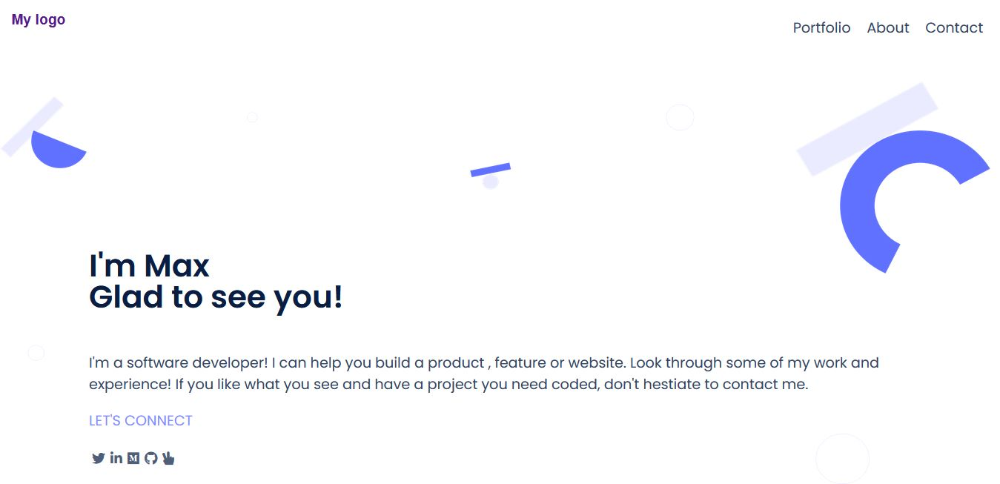

# Portfolio

This project is a build of my official Software Developer portfolio.

The project showcases previous projects with links to visit and explore its awesome features
in the hopes to build a fantastic reputation as a Software Developer.

## Built With:
 - HTML
 - CSS
 - JavaScript.
 - External libraries (AOS and Bootstrap)

## Live Demo
Use the link below to access the deployed page.

[Portfolio web](https://i-max-xi.github.io/Appiah-Gyimah-Maxwell/)

⛔ Some unmerged changes may not be displayed in deploy.

## Show your support
Give a ⭐️ if you like this project!

👤 **Author** 
  - linkedIn: https://www.linkedin.com/in/appiah-maxwell-0212b41a1/
  - GitHub: https://github.com/i-max-xi

## Acknowledgement:
   - Big thanks to Microverse.
   - Hat tip to W3css and every website that trained me to code.
   - etc.

## 📝 License
   This project is [MIT](license.md) licensed.
